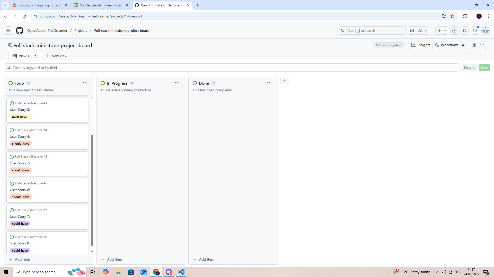
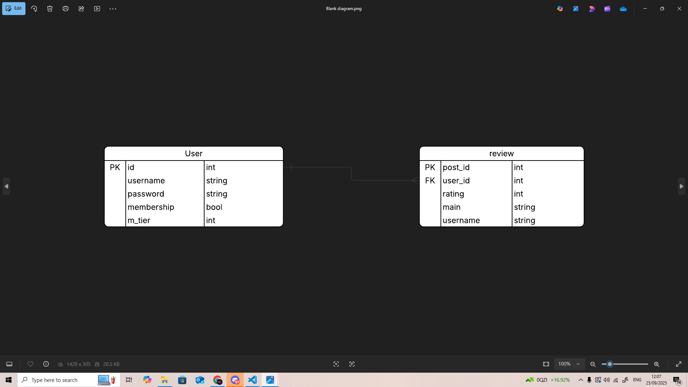
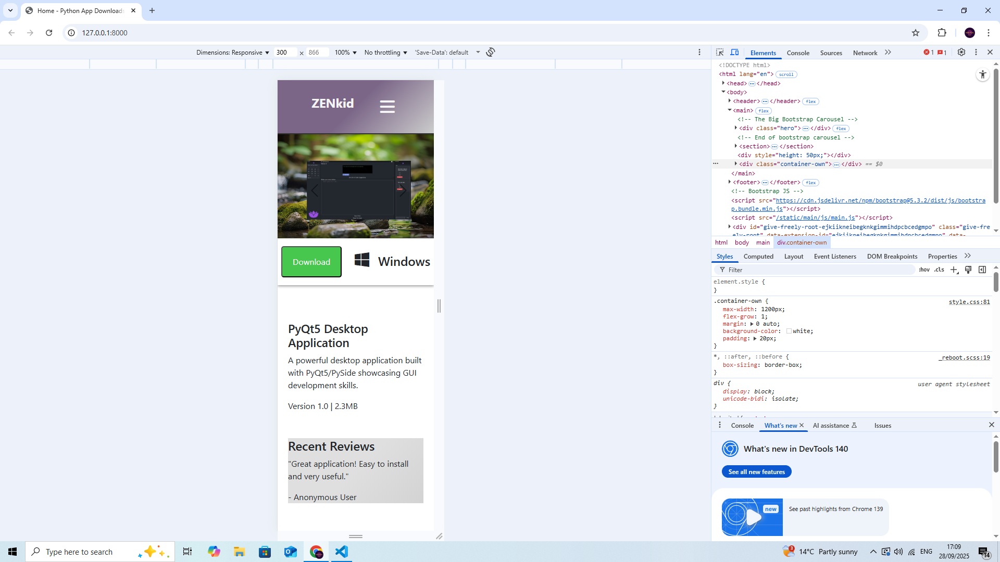
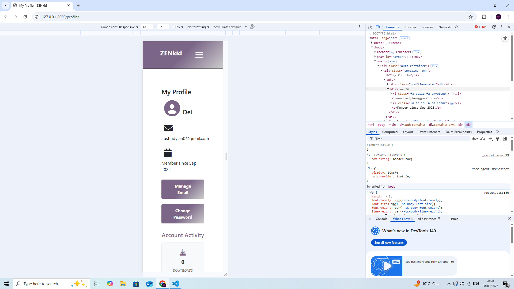

# Full-Stack-Milestone

Here is my first full-stack project to pass my course at CodeInstitute.

It is a website where you can download an application I have been making alongside the course, in order to learn my stack better (Python) - using PyQt5/Pyside.

I will make this project documenting it's initial development plans and development progress, within this README and github version control.

## The Development Ideas

Click to view development planning details

This section contains all the initial planning and development ideas for the project.

## Initial Project Board and development plans

Here in this image we can see the initial start of my work-load with 8 user stories. Keeping my project manageable, compact and simple.

## Wire Frames

Here is the initial idea of the home page where you can see a carousel and review posts.

Here is an idea for what the user dashboard can look like. Where you can delete your account, update your details and access the membership manager.

## The Creation of Data Models

Here I had the idea of creating a membership and membership type for the user model, and only a second model for the creation of reviews. Keeping my project functional and manageable.

## End of Development Ideas

## Project Specs

🚀 <strong>Project Specs</strong>

**Frontend:**
- HTML5/CSS3
- JavaScript
- Bootstrap/CSS

**Backend:**
- Python/Django

**Deployment:**
- Heroku
- GitHub Pages (frontend)

## The Build

Click to view development planning details

**Initial Setup**
- I had co pilot help with wiring django, setting up static files, templates and settings.py
- After realising copilot had created a full website based on my model, I asked him to strip it down to nothing.
this way I can learn from building myself
- Manual styling and bootstrap for styling my initial webpage
- Having my user-model based on django allauth

- Will now move on to setting up my home page

**The Home Page**
- To get my desired result in regards to my wireframes, I have began some manual CSS.
- I have implemented font awesome for using Icons - Currently using the burger dropdown menu. 'Bars'.

- Started organizing the home.html and base.html to get the right structure, and styled with CSS. No AI used.
- Trying to get the mobile view sorted then I'll move on to bigger screens. I'm thinking mobile view, with 
all the functionality coded in. That why I can just scale the CSS in the end.

- Made a proper drop down for the nav links with hover effects.

**Change Allauth Templates**
- I asked copilot to help me understand overriding templates and had made all the preset names to make html
documents. He took the style of my webpage and styled them accordingly

- Asked copilot how to setup url for profile page and he created it with a unique styling. 
- I'm having to go through the CSS he has made and make adjustments since there are margin issues.
- had copilot helping solving why there was a sidescroll. it seems he set up a grid (I hate this prompt code.
if only I knew django)

**Profile Page**

- Managed to get the CSS structured properly for mobile. Still made up of copilot's CSS response, but I have changed
the format.

